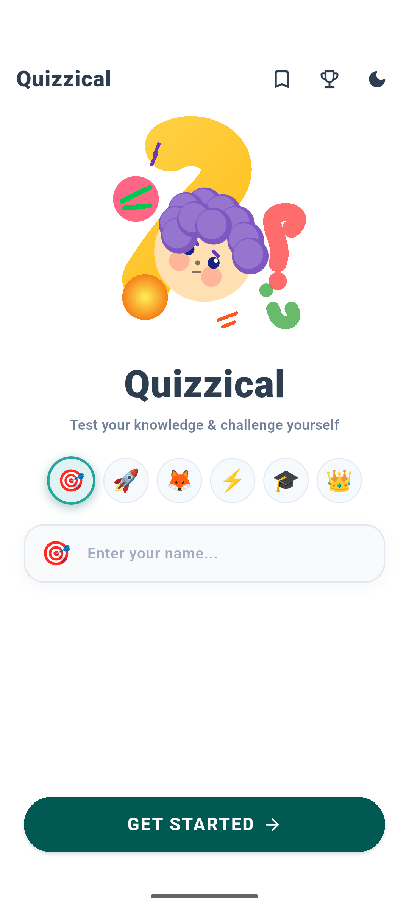
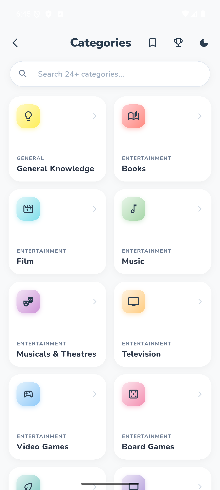
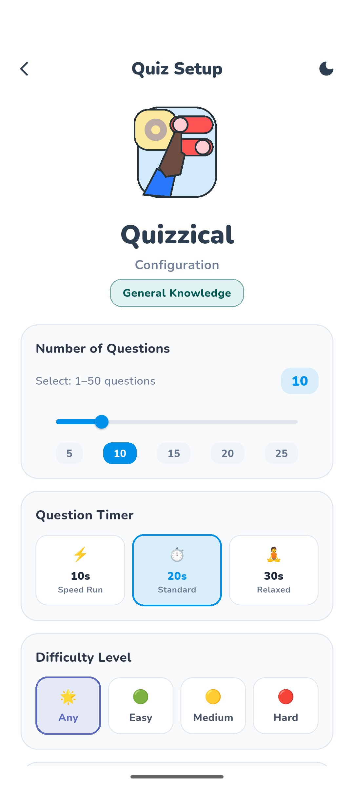
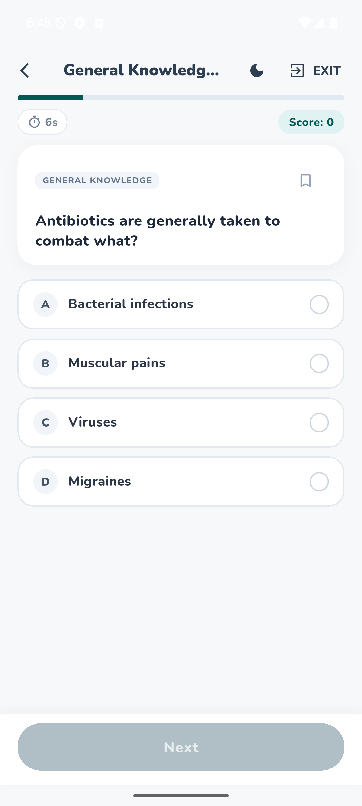
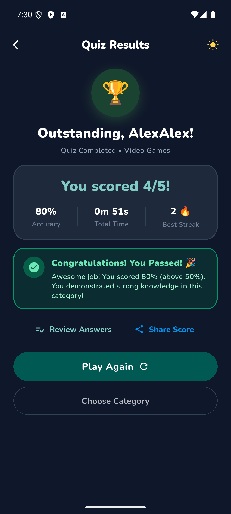
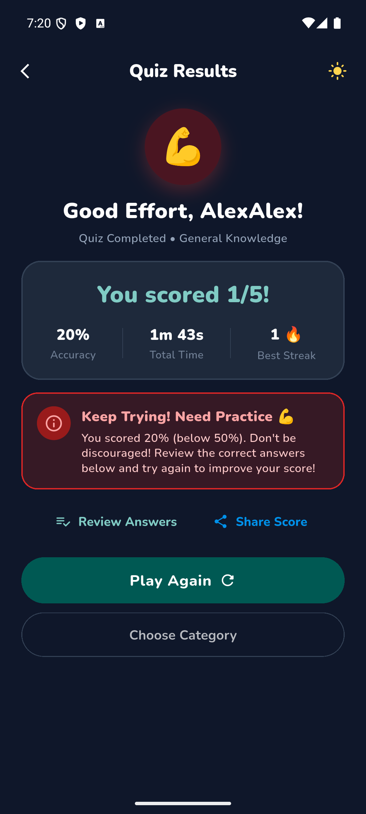
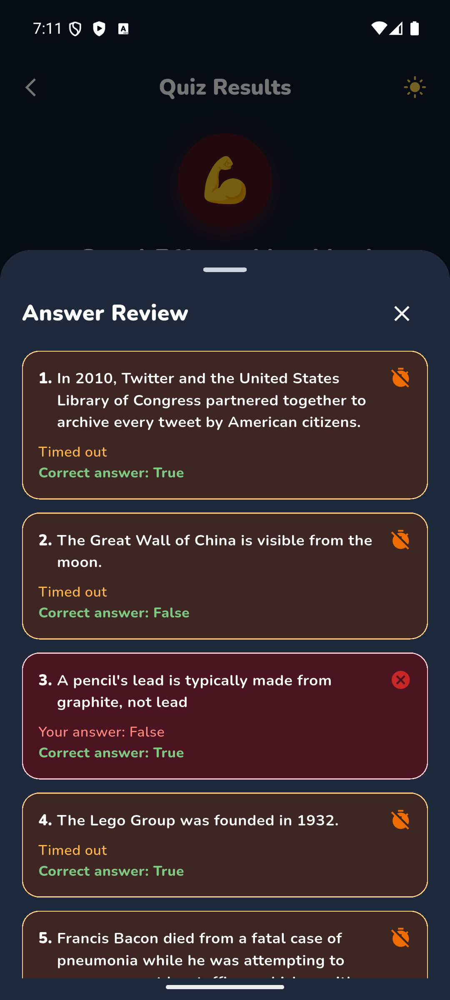
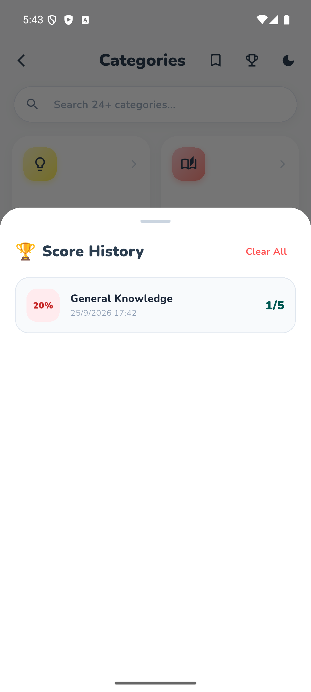
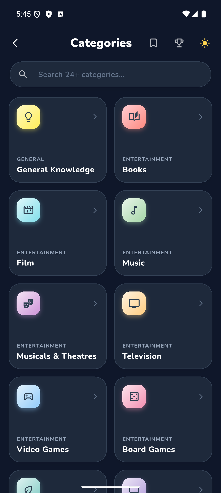

# Quizzical 🎯

[](https://flutter.dev/)
[](https://dart.dev/)
[](https://www.android.com/)
[](#-download--install-apk)
[](LICENSE)

**Quizzical** is a feature-rich, high-performance quiz application built with Flutter. Test your knowledge across a wide variety of categories, configure your challenge, and track your performance with real-time feedback—all in an intuitive, beautifully animated interface with Light & Dark theme support.

---

## 📥 Download & Install (APK)

Ready-to-install Android Release APKs (optimized to **10–20 MB**):

| Architecture | Recommended Devices | APK Size | Direct Download Link |
| :--- | :--- | :--- | :--- |
| **ARM 64-bit** (`arm64-v8a`) | Most modern Android smartphones & tablets | **~16.0 MB** | [Download Quizzical (arm64-v8a)](releases/Quizzical-arm64-v8a-release.apk?raw=true) |
| **ARM 32-bit** (`armeabi-v7a`) | Older Android smartphones | **~14.0 MB** | [Download Quizzical (armeabi-v7a)](releases/Quizzical-armeabi-v7a-release.apk?raw=true) |

> **Note:** Since the APK is signed for direct installation, make sure to enable *"Install from Unknown Sources"* on your Android device when prompted.

---

## 📱 Screenshots

<div align="center">

| 1. Welcome Screen | 2. Category Selection | 3. Quiz Configuration |
| :---: | :---: | :---: |
|  |  |  |

| 4. Live Quiz Screen | 5. Results (Passed ≥ 50%) | 6. Results (Below < 50%) |
| :---: | :---: | :---: |
|  |  |  |

| 7. Detailed Answer Review | 8. Score History & Leaderboard | 9. Dark Mode Theme |
| :---: | :---: | :---: |
|  |  |  |

</div>

---

## ✨ Key Features

- **Personalized Onboarding**: Enter your name to tailor the entire quiz experience.
- **24+ Diverse Categories**: General Knowledge, Science, Books, Film, Music, Video Games, Board Games, and more.
- **Customizable Quiz Experience**:
  - Select question count (5 to 50 questions).
  - Set per-question timers (10s Speed Run, 20s Standard, 30s Relaxed).
  - Choose difficulty (Any, Easy, Medium, Hard).
- **Interactive Quiz Engine**:
  - Live timer with progress indicators.
  - Streak tracking with milestone rewards.
  - Bookmark tricky questions during the quiz for later review.
- **Comprehensive Results & Analytics**:
  - Instant breakdown of accuracy percentage, total time taken, and best streak.
  - Detailed Answer Review showing questions answered, correct solutions, and timeout statuses.
- **Score History**: Local persistent tracking of your past quiz scores and completions.
- **Sleek Light & Dark Themes**: Fully adapted dark and light color palettes for day or night use.
- **Optimized Size & Fast Load**: Tree-shaken icons and ABI-split binaries keep the app lightweight (**14–16 MB**).

---

## ⚡ Size Optimization

To ensure fast downloads and optimal performance, the app is compiled using:
1. **ABI Splitting (`--split-per-abi`)**: Produces architecture-specific native packages rather than an oversized fat universal binary.
2. **Icon & Font Tree-Shaking**: Strips unused font glyphs, achieving up to 99% font asset size reduction.
3. **Dart Code Obfuscation & R8 Minification**: Compresses class and method footprints.

**Resulting Sizes:**
- `app-armeabi-v7a-release.apk`: **14.3 MB**
- `app-arm64-v8a-release.apk`: **17.0 MB**

---

## 🛠 Tech Stack & Architecture

- **Framework:** [Flutter](https://flutter.dev/) (Channel stable, 3.41.x)
- **Language:** [Dart](https://dart.dev/)
- **State Management:** [Provider](https://pub.dev/packages/provider)
- **Networking:** [http](https://pub.dev/packages/http) (Open Trivia DB API)
- **Local Persistence:** [shared_preferences](https://pub.dev/packages/shared_preferences)
- **Typography:** [Google Fonts](https://pub.dev/packages/google_fonts) (Nunito)
- **Architecture Pattern:** MVVM (Model-View-ViewModel) with decoupled Providers and Services

### Project Structure

```text
lib/
├── models/         # Question, Category, QuizHistory models
├── providers/      # QuizProvider (state logic, timer, scoring)
├── screens/        # Welcome, CategorySelection, QuizConfig, Quiz, Results
├── services/       # Open Trivia API integration
├── widgets/        # Illustrations, answer review, sheets & reusable components
└── main.dart       # App initialization & theme definitions
```

---

## 🚀 Getting Started Locally

### Prerequisites

- [Flutter SDK](https://docs.flutter.dev/get-started/install) (3.22+)
- Java JDK 17 or 21
- Android Studio / VS Code / Connected Android Device or Emulator

### Installation & Run

1. **Clone the repository:**
   ```bash
   git clone https://github.com/imamhossenbu/flutter-quizzable.git
   cd flutter-quizzable
   ```

2. **Install dependencies:**
   ```bash
   flutter pub get
   ```

3. **Run on an active emulator or device:**
   ```bash
   flutter run
   ```

4. **Build release APKs:**
   ```bash
   flutter build apk --release --split-per-abi
   ```

---

## 📄 License

This project is licensed under the MIT License.
